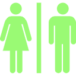

# Public-Toilet-Nearby

  
     

  
  
  
  
  
  

# Visit Public-Toilet-Nearby: [https://public-toilet-nearby](https://near-me-toilet-xzup.onrender.com/)  

 

https://github.com/gagataiga/Public-Toilet-NearBy/assets/67191126/df0df205-43db-40f4-ac09-a3723d3223e3

## Description
Public-Toilet-Nearby is a service that allows you to find nearby public toilets, regardless of whether they are free or paid. You can choose a toilet you want to visit from your current location and even get directions, ensuring you can easily find a restroom without getting lost.

 
"This app has been deployed, but I'm currently considering where to deploy it, especially since it's taking a long time to render.　Also, due to the low number of posts, toilets may not actually be displayed in your area."

 

## Why do I want to create this app?

The purpose behind creating this service stems from my personal experiences during my time living abroad. I found it incredibly challenging to locate restrooms, and I often felt the lack of services helping me find available restroom facilities.

 

## Tech Stack  

| Task | Tech |  
| --------- | ------- |  
| Front-End | | 
| Library |  |
| Language | |
| User Auth and Storage | |
| Routing API | Open Route Service |
| Making UI Richer|  |
| State Management | | 
|Back-End | |
|Language|   |
| Framework |  |
| DataBase |  | 
| Query Builder | Knex |
| Deploy | Render |

 

## Description of features 

#### User Authentication and SignIn/SignOut:
- Allow users to sign in and sign out securely, ensuring authentication protocols are in place.

#### Create New Posts:
- Enable users to compose detailed posts, including text, an image file, ratings, facilities, and location information.
 
#### Create Reviews:
- Allow users to create reviews for posts made by other users, fostering a sense of community interaction and feedback.

#### View Posts on Map:
- Display posts from other users and yours on a map view, providing a visual representation of where posts are located geographically.

#### Routing to Specified Locations:
- Implement routing functionality that allows users to plan routes and navigate to specified locations based on the information provided in the posts.
 
#### Check User's Current Location on Map View:
- Enable users to view their own current location on the map, enhancing their overall map interaction experience.

#### Filter by facilities
- Users can filter toilets based on their preferences by selecting filter tags, allowing them to find the restroom they are looking for.

#### Navigation via Menu Bar
- Users can navigate to their desired pages by selecting the menu and transitioning to the page they want.

#### Confirmation of Own Posts:
- Users can review their own posts on the 'Posts' page. Additionally, they can also check reviews for each of their posts.

 

## Future Features 
- Allow users to delete their posts.

- Enable users to edit their posts or reviews.
  
- Use an API that provides information on department stores and nearby convenience stores where restrooms are likely to be found, and actually display them on a map.
  
- Add additional facilities information.
  
- Implement a navigation feature.
  
- Deploy the application on a different cloud service due to slow rendering on render.com. AWS or GCP.

- Add tests with Jest jest and cypress.
  
- Use Docker in the project and deploy with it.

 

## License

MIT License

Copyright (c) 2023 Taiga Shiga

Permission is hereby granted, free of charge, to any person obtaining a copy
of this software and associated documentation files (the "Software"), to deal
in the Software without restriction, including without limitation the rights
to use, copy, modify, merge, publish, distribute, sublicense, and/or sell
copies of the Software, and to permit persons to whom the Software is
furnished to do so, subject to the following conditions:

The above copyright notice and this permission notice shall be included in all
copies or substantial portions of the Software.

THE SOFTWARE IS PROVIDED "AS IS", WITHOUT WARRANTY OF ANY KIND, EXPRESS OR
IMPLIED, INCLUDING BUT NOT LIMITED TO THE WARRANTIES OF MERCHANTABILITY,
FITNESS FOR A PARTICULAR PURPOSE AND NONINFRINGEMENT. IN NO EVENT SHALL THE
AUTHORS OR COPYRIGHT HOLDERS BE LIABLE FOR ANY CLAIM, DAMAGES OR OTHER
LIABILITY, WHETHER IN AN ACTION OF CONTRACT, TORT OR OTHERWISE, ARISING FROM,
OUT OF OR IN CONNECTION WITH THE SOFTWARE OR THE USE OR OTHER DEALINGS IN THE
SOFTWARE.
